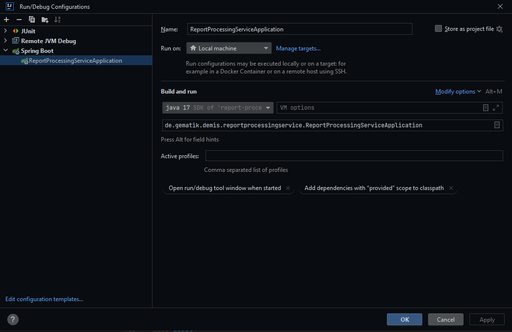

 <br/>

# Report-Processing-Service

<details>
  <summary>Table of Contents</summary>
  <ol>
    <li>
      <a href="#about-the-project">About The Project</a>
       <ul>
        <li><a href="#quality-gate">Quality Gate</a></li>
        <li><a href="#release-notes">Release Notes</a></li>
      </ul>
	</li>
    <li>
      <a href="#getting-started">Getting Started</a>
      <ul>
        <li><a href="#prerequisites">Prerequisites</a></li>
        <li><a href="#installation">Installation</a></li>
        <li><a href="#local">Local</a></li>
      </ul>
    </li>
    <li>
      <a href="#usage">Usage</a>
      <ul>
        <li><a href="#endpoints">Endpoints</a></li>
      </ul>
    </li>
    <li><a href="#security-policy">Security Policy</a></li>
    <li><a href="#contributing">Contributing</a></li>
    <li><a href="#license">License</a></li>
    <li><a href="#contact">Contact</a></li>
  </ol>
</details>

## About The Project 

This service serves as a central processing point for report notifications to the DEMIS core. As a central interface,
other services such as the validation service are addressed, the results are bundled and transferred to the NCAPI. When
errors occur, they must be processed and bundled and output to the user in such a way that no safety-critical
information about the system becomes known

### Quality Gate
[](https://sonar.prod.ccs.gematik.solutions/dashboard?id=de.gematik.demis%3Areport-processing-service)[](https://sonar.prod.ccs.gematik.solutions/dashboard?id=de.gematik.demis%3Areport-processing-service)[](https://sonar.prod.ccs.gematik.solutions/dashboard?id=de.gematik.demis%3Areport-processing-service)[](https://sonar.prod.ccs.gematik.solutions/dashboard?id=de.gematik.demis%3Areport-processing-service)[](https://sonar.prod.ccs.gematik.solutions/dashboard?id=de.gematik.demis%3Areport-processing-service)[](https://sonar.prod.ccs.gematik.solutions/dashboard?id=de.gematik.demis%3Areport-processing-service)

[](https://sonar.prod.ccs.gematik.solutions/dashboard?id=de.gematik.demis%3Areport-processing-service)

### Release Notes

See [ReleaseNotes](../ReleaseNotes.md) for all information regarding the (newest) releases.


## Getting Started

### Prerequisites

**Hint:**

For usage or perform the tests, sample data must be added to the files:

* src/main/resources/application.properties.template
    * The following values has to be set:
        * ncs.apikey

Afterwards, please remove the ".template" suffix so that the files can be used in the code.


### Installation

Hint:
there is 2 test ik numbers in hospital-location-service: `987654321 & 098765432`.
The ik number will be extracted from the jwt, you can adjust the ik-attribute in keycloak to use one of the test numbers

```sh
mvn clean verify
```

The Project can be built with the following command:

```sh
mvn clean install
```
build with docker image:

```docker
docker build -t report-processing-service:latest .
```
The Docker Image associated to the service can be built alternatively with the extra profile `docker`:

```docker
mvn clean install -Pdocker
```

### Local

Run from IntelliJ as SpringBoot Application




## Usage

The application can be executed from a mvn command file or a Docker Image:

```sh
# using a mvn command
mvn clean spring-boot:run`
Check the server with: `curl -v localhost:8080/status`
# As Docker Image
docker run -p 8081:8081 -dt --name rps-container report-processing-service:latest` or add to a yaml file from e.g. [this project](https://gitlab.prod.ccs.gematik.solutions/git/demis/demis
```

### Endpoints

| Endpoint                      | Description                                                                                      |
|-------------------------------|--------------------------------------------------------------------------------------------------|
| `/$process-report`            | POST endpoint for report notifications.                                                             |
| `/actuator/health/`           | Standard endpoint from Actuator.                                                                   |
| `/actuator/health/liveness`   | Standard endpoint from Actuatorr                                                                     |
| `/actuator/health/readiness`  | Standard endpoint from Actuator.                                                                    |
| `/swagger-ui/index.html`      | Swagger UI documentation endpoint. Provides a user interface to interact with endpoints. Lists endpoints, headers, and the format of requests and responses.

Listed are endpoints, headers, and format of requests and responses.

## Security Policy

If you want to see the security policy, please check our [SECURITY.md](SECURITY.md).

## Contributing

If you want to contribute, please check our [CONTRIBUTING.md](CONTRIBUTING.md).

## License

EUROPEAN UNION PUBLIC LICENCE v. 1.2

EUPL © the European Union 2007, 2016

Copyright (c) 2023 gematik GmbH

See [LICENSE](../LICENSE.md).

## Contact

E-Mail to [DEMIS Entwicklung](mailto:demis-entwicklung@gematik.de?subject=[GitHub]%20Validation-Service)
